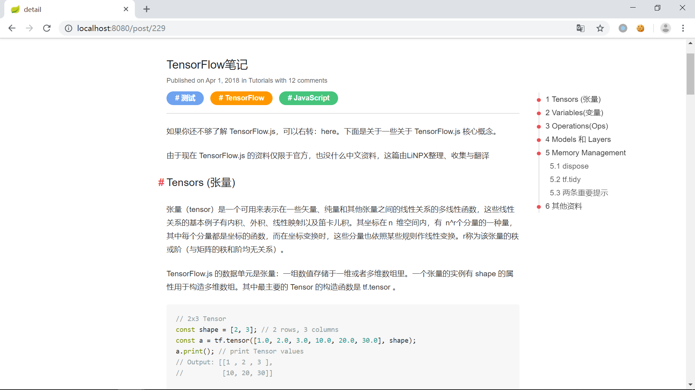
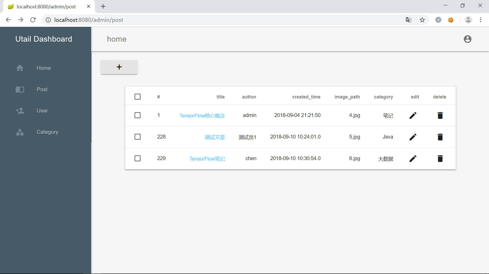
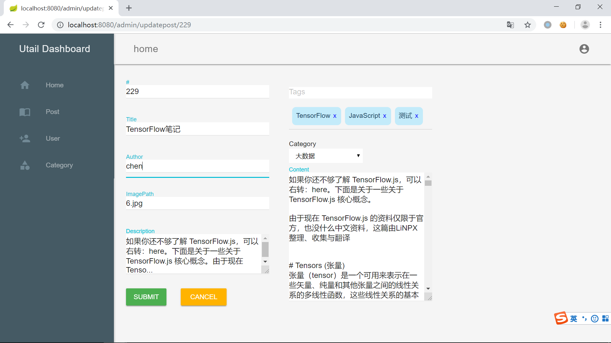

# utail

本项目是java博客项目[tale](https://github.com/otale/tale)的另一个实现版本, 主要使用的是springboot(1.5.15)实现. 

## 技术选型

- springboot 1.5.15

- spring-core-4.3.18.RELEASE

- spring-boot-starter-thymeleaf-1.5.15.RELEASE

- thymeleaf.layout-dialect-2.3.0
- mysql-connector-java-6.0.6

- pegdown-1.6.0

- hibernate-core-5.0.12.Final

- spring-webmvc-4.3.18.RELEASE

## 开始项目

1. 将项目导入, 该项目是maven构建的, (Eclipse下)选择导入`Import > Existing Maven Projects`即可 
2. 创建数据库utail
3. 修改application.properties文件中的配置(数据库用户名, 密码)
4. 运行项目, 访问
  [前台](localhost:8080)
  [后台](localhost:8080/admin)

## 截图
### 前台主页

### 博客详情

### 后台博客管理

### 后台博客更新

